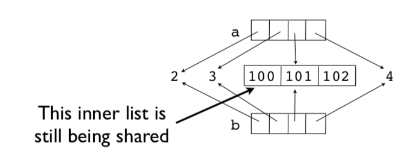

[Contents](../Contents.md) \| [Previous (2.6 List Comprehensions)](06_List_comprehension.md) \| [Next (3 Program Organization)](../03_Program_organization/00_Overview.md)

# 2.7 Objects

This section introduces more details about Python's internal object model and
discusses some matters related to memory management, copying, and type checking.

### Assignment

Many operations in Python are related to *assigning* or *storing* values.

```python
a = value         # Assignment to a variable
s[n] = value      # Assignment to a list
s.append(value)   # Appending to a list
d['key'] = value  # Adding to a dictionary
```

*A caution: assignment operations **never make a copy** of the value being assigned.*
All assignments are merely reference copies (or pointer copies if you prefer).

### Assignment example

Consider this code fragment.

```python
a = [1,2,3]
b = a
c = [a,b]
```

A picture of the underlying memory operations. In this example, there
is only one list object `[1,2,3]`, but there are four different
references to it.


This means that modifying a value affects *all* references.

```python
>>> a.append(999)
>>> a
[1,2,3,999]
>>> b
[1,2,3,999]
>>> c
[[1,2,3,999], [1,2,3,999]]
>>>
```

Notice how a change in the original list shows up everywhere else
(yikes!).  This is because no copies were ever made. Everything is
pointing to the same thing.

### Reassigning values

Reassigning a value *never* overwrites the memory used by the previous value.

```python
a = [1,2,3]
b = a
a = [4,5,6]

print(a)      # [4, 5, 6]
print(b)      # [1, 2, 3]    Holds the original value
```

Remember: **Variables are names, not memory locations.**

### Some Dangers

If you don't know about this sharing, you will shoot yourself in the
foot at some point.  Typical scenario. You modify some data thinking
that it's your own private copy and it accidentally corrupts some data
in some other part of the program.

*Comment: This is one of the reasons why the primitive datatypes (int,
 float, string) are immutable (read-only).*

### Identity and References

Use the `is` operator to check if two values are exactly the same object.

```python
>>> a = [1,2,3]
>>> b = a
>>> a is b
True
>>>
```

`is` compares the object identity (an integer).  The identity can be
obtained using `id()`.

```python
>>> id(a)
3588944
>>> id(b)
3588944
>>>
```

Note: It is almost always better to use `==` for checking objects.  The behavior
of `is` is often unexpected:

```python
>>> a = [1,2,3]
>>> b = a
>>> c = [1,2,3]
>>> a is b
True
>>> a is c
False
>>> a == c
True
>>>
```

### Shallow copies

Lists and dicts have methods for copying.

```python
>>> a = [2,3,[100,101],4]
>>> b = list(a) # Make a copy
>>> a is b
False
```

It's a new list, but the list items are shared.

```python
>>> a[2].append(102)
>>> b[2]
[100,101,102]
>>>
>>> a[2] is b[2]
True
>>>
```

For example, the inner list `[100, 101, 102]` is being shared.
This is known as a shallow copy.  Here is a picture.



### Deep copies

Sometimes you need to make a copy of an object and all the objects contained within it.
You can use the `copy` module for this:

```python
>>> a = [2,3,[100,101],4]
>>> import copy
>>> b = copy.deepcopy(a)
>>> a[2].append(102)
>>> b[2]
[100,101]
>>> a[2] is b[2]
False
>>>
```

### Names, Values, Types

Variable names do not have a *type*. It's only a name.
However, values *do* have an underlying type.

```python
>>> a = 42
>>> b = 'Hello World'
>>> type(a)
<type 'int'>
>>> type(b)
<type 'str'>
```

`type()` will tell you what it is. The type name is usually used as a function
that creates or converts a value to that type.

### Type Checking

How to tell if an object is a specific type.

```python
if isinstance(a, list):
    print('a is a list')
```

Checking for one of many possible types.

```python
if isinstance(a, (list,tuple)):
    print('a is a list or tuple')
```

*Caution: Don't go overboard with type checking. It can lead to
excessive code complexity.  Usually you'd only do it if doing
so would prevent common mistakes made by others using your code.
*

### Everything is an object

Numbers, strings, lists, functions, exceptions, classes, instances,
etc. are all objects.  It means that all objects that can be named can
be passed around as data, placed in containers, etc., without any
restrictions.  There are no *special* kinds of objects.  Sometimes it
is said that all objects are "first-class".

A simple example:

```python
>>> import math
>>> items = [abs, math, ValueError ]
>>> items
[<built-in function abs>,
  <module 'math' (builtin)>,
  <type 'exceptions.ValueError'>]
>>> items[0](-45)
45
>>> items[1].sqrt(2)
1.4142135623730951
>>> try:
        x = int('not a number')
    except items[2]:
        print('Failed!')
Failed!
>>>
```

Here, `items` is a list containing a function, a module and an
exception.  You can directly use the items in the list in place of the
original names:

```python
items[0](-45)       # abs
items[1].sqrt(2)    # math
except items[2]:    # ValueError
```

With great power comes responsibility.  Just because you can do that doesn't mean you should.
